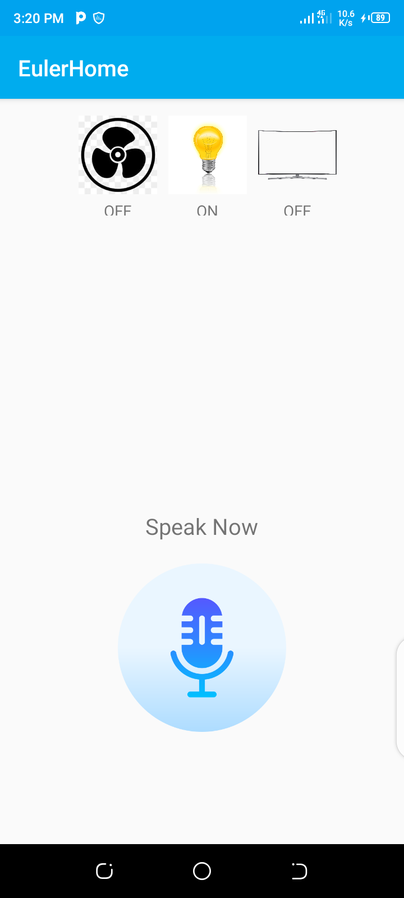

# EulerIOTApp
This is an android app with a simple interface that implements an Internet of Things (IOT) functionality. It communicates and shares data with other devices such as fan, bulb and television via an API. Some of the technologies used include: Kotlin (primary language), Speech recognition (not Google), Retrofit, OKHttp interceptor
# Screenshot

